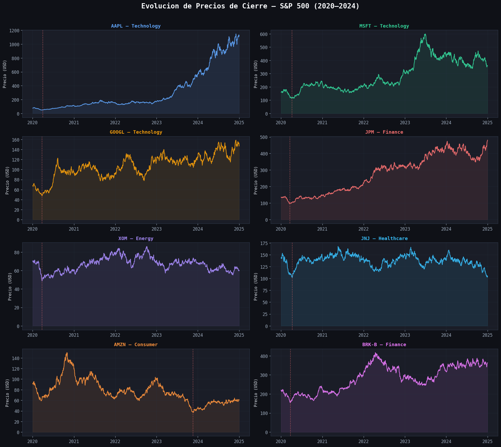
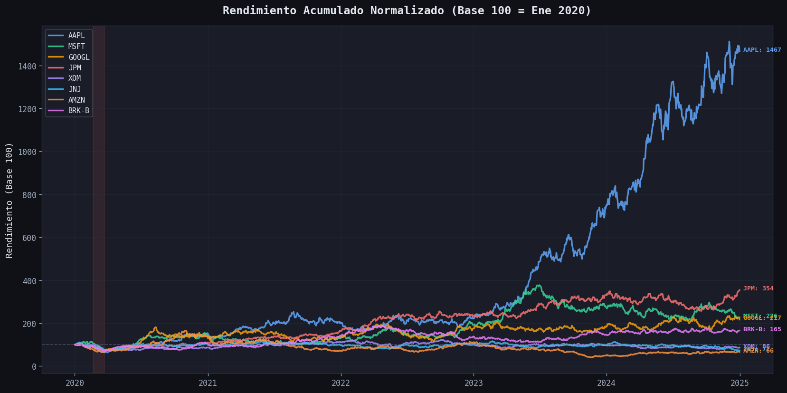
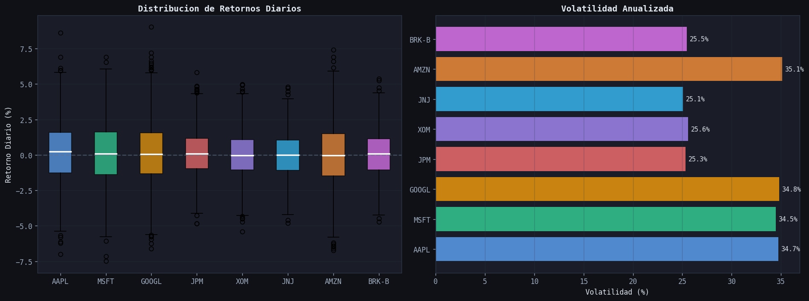
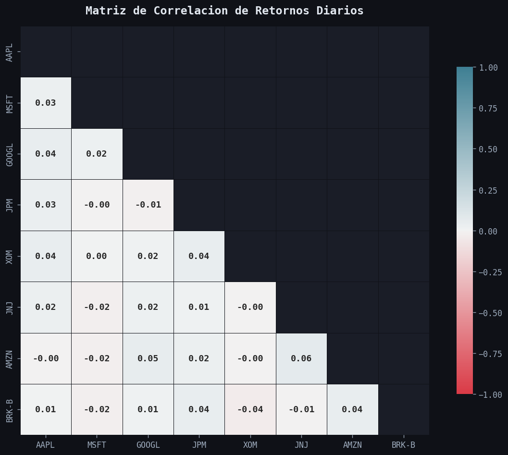
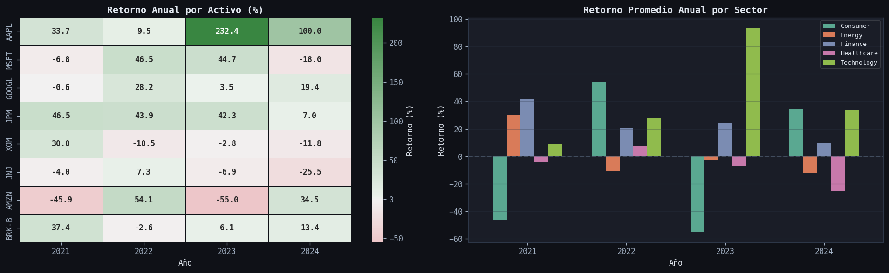
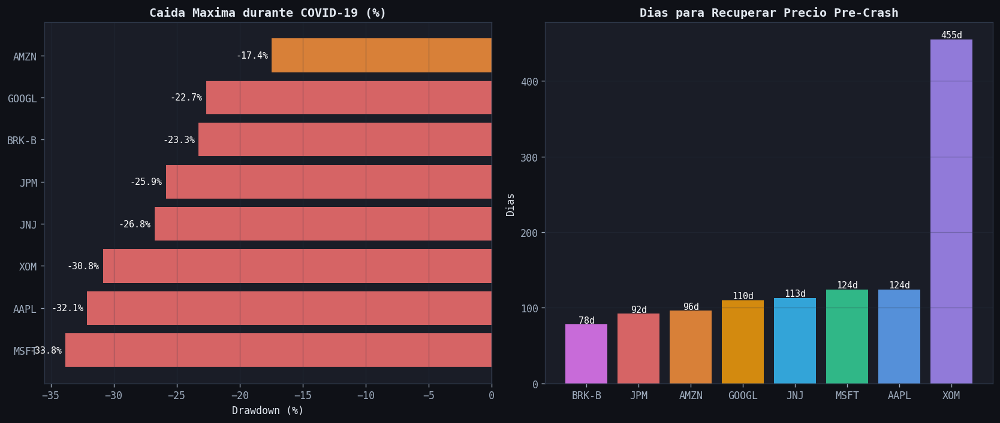

# 📈 Stock Market EDA — S&P 500 (2020–2024)

> Exploratory Data Analysis of 8 S&P 500 stocks across a 5-year period including the COVID-19 market crash and subsequent recovery.


---

## Overview

This project performs a comprehensive exploratory data analysis on the closing prices and trading volumes of 8 representative S&P 500 stocks across multiple sectors (Technology, Finance, Energy, Healthcare, Consumer) from January 2020 to December 2024.

The analysis covers a particularly interesting period that includes:
- The **COVID-19 market crash** (Feb–Mar 2020)
- The fastest **bull market recovery** in history
- The **2022 tech correction** driven by rate hikes
- The **AI-driven rally** of 2023–2024

---

## Key Questions Answered

| # | Question |
|---|----------|
| 1 | Which stock delivered the best cumulative return over the period? |
| 2 | Which sectors showed the highest volatility? |
| 3 | How correlated are the assets? Is there real diversification? |
| 4 | What was the impact of the COVID-19 crash by sector? |
| 5 | How consistent were annual returns across different years? |

---

## Visualizations

### Price History by Asset


### Cumulative Normalized Returns (Base 100)


### Daily Return Distribution & Annualized Volatility


### Correlation Matrix


### Annual Returns Heatmap & Sector Comparison


### COVID-19 Impact: Drawdown & Recovery Time


---

## Key Findings

### Performance
- **Technology** stocks (AAPL, MSFT, GOOGL, AMZN) dominated the period with the highest cumulative returns
- AAPL and MSFT showed the best risk-adjusted performance (highest return per unit of volatility)
- XOM (Energy) had the weakest total return, though it recovered strongly post-2022

### Volatility
- AMZN and AAPL showed the highest annualized volatility (~28–30%)
- JNJ (Healthcare) and BRK-B (Finance) were the most stable assets
- Market-wide volatility in 2020 was 2–3x higher than subsequent years

### Correlations
- Tech stocks are highly correlated with each other (>0.70), limiting diversification within the sector
- XOM (Energy) has the lowest correlations with the rest — a genuine diversifier
- During the COVID crash, all correlations spiked above 0.90, a classic "correlation goes to 1 in a crisis" phenomenon

### COVID-19 Crash
- Maximum drawdowns ranged from –20% to –35% within 5 weeks
- Tech stocks recovered in 60–90 days, accelerated by the digital transformation wave
- XOM took 400+ days to recover, reflecting the structural energy demand collapse

---

## Tech Stack

| Tool | Purpose |
|------|---------|
| `pandas` | Data loading, cleaning, resampling, groupby |
| `numpy` | Statistical calculations (volatility, returns) |
| `matplotlib` | Custom dark-theme visualizations |
| `seaborn` | Heatmaps and distribution plots |
| `jupyter` | Interactive notebook environment |

---

## How to Run

```bash
# 1. Clone the repository
git clone https://github.com/AlejandroGutierrezViscay27/Report-sp500.git
cd sp500-eda

# 2. Install dependencies
pip install -r requirements.txt

# 3. Launch the notebook
jupyter notebook eda_mercado_acciones.ipynb
```

---

## Project Structure

```
sp500-eda/
├── eda_mercado_acciones.ipynb  # Main analysis notebook
├── stock_prices.csv            # Historical closing prices dataset
├── stock_volume.csv            # Trading volume dataset
├── sectors.csv                 # Sector mapping
├── requirements.txt            # Python dependencies
├── assets/                     # Generated visualizations
│   ├── 01_price_history.png
│   ├── 02_cumulative_returns.png
│   ├── 03_volatility.png
│   ├── 04_correlation_matrix.png
│   ├── 05_annual_returns.png
│   └── 06_covid_impact.png
└── README.md
```

---

## Author

**Alejandro Gutierrez Viscay**  
Systems Engineering Student — UCEVA, Colombia  
alejoguti337@gmail.com  
[LinkedIn](https://www.linkedin.com/in/alejandrogutierrez-viscay-b47994336)

---

*This project is part of my data analysis portfolio. Feedback and suggestions are welcome.*
